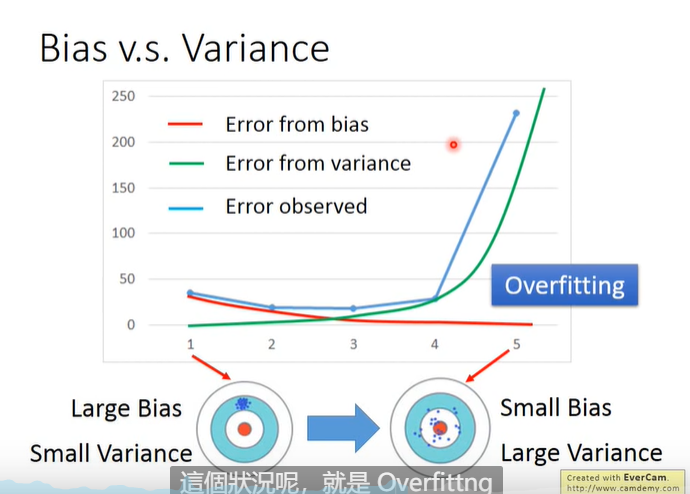

# Basic Concept

什么是梯度
$$
E(w,b)=\sum_{n=1}^{m}(y_i-(wx_i+b))^2\\
\frac{\partial E(w,b)}{\partial b}=2[w\sum_{n=1}^mx_i^2-\sum_{n=1}^m(y_i-b)x_i]\\
\frac{\partial E(w,b)}{\partial b}=2[mb-\sum_{n=1}^m(y_i-wx_i)]\\
分别令\frac{\partial E(w,b)}{\partial b},\frac{\partial E(w,b)}{\partial b}即可求出w,b的值\\
w=\frac{\sum_{n=1}^{m}(x_i-\bar x)(x_i-\bar y)}{\sum_{n=1}^m(x_i-\bar x)^2}\\
b = \frac{1}{m}\sum_{n=1}^m(y_i-wx_i)
$$

## Bias and Variance

**Bias**——偏差
**Variance**——方差

一般来说，model越复杂，Bias越小，Variance越大

error主要来自于Variance，这种情况是Overfitting

error主要来自于Bias，那么这种情况是underfitting

